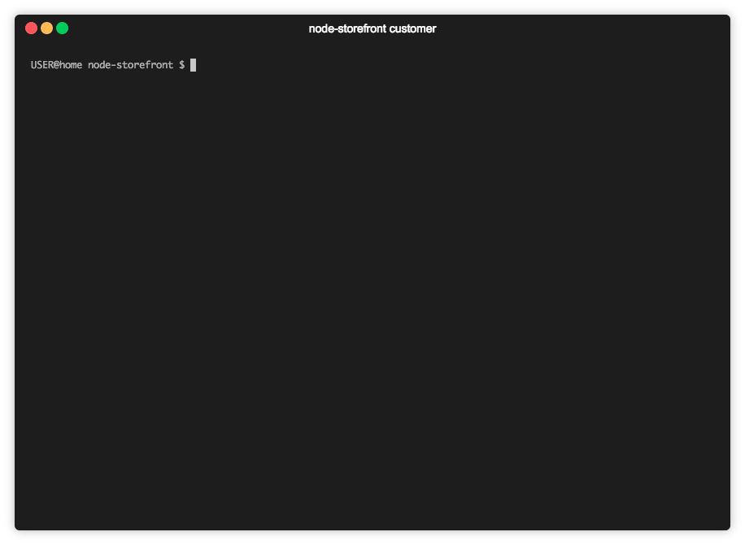

# Node-Storefront

## Introduction

Node-Storefront is a CLI interface application that uses node.js and a local MySQL database to simulate a rudimentary retail/sales database. The purpose of Node-Storefront is to use MySQL queries to both return relavant data and modify the database through user input. 

## Installation

The node-storefront CLI can be installed by cloning this repository and installing it's node dependencies.

```sh
npm install
```

In order to interface with a database the user must also create a local database, which can be done so by running the included database schema in a database management application. 


## Functionality 

The app has two main javascipt files, `customer.js` and `manager.js`, which each feature related but distinctly different functionalities. 

### _customer.js_



```sh
node customer
```

The customer file features a table of all the available products and their respective quantities and prices. The customer is then able to select a product by id and complete a purchase. There is also simple input validation for choosing valid product ids and quantities. User input is then used to update the database.

### _manager.js_


```sh
node manager
```

The manager CLI features more powerful queries that are able to update and create products. Such as:

- View Products for Sale
- View Low Inventory
- Add More Inventory
- Add New Product

As with the customer.js file the manager features input validation that prevents incorrect entries into the database.

## Future Developments

The node-storefront is more of a proof of concept rather than an app with real utility. It shows the apparent simplicity of updating a database when sql queries are placed behind a user friendly front-end. In developing new queries and user options it would be more efficient if the current app was written in sequelize or another ORM framework. 